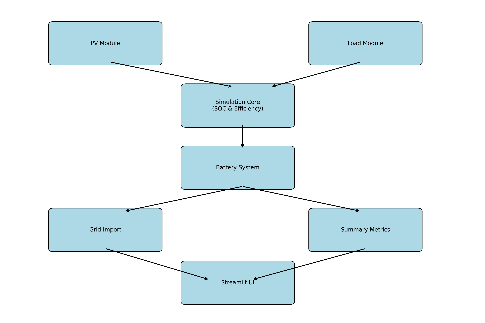

# PV + Battery Energy System Simulator

A modular simulation tool to model photovoltaic (PV) generation and battery storage behavior under different weather and usage conditions. Built in **Python** and **Streamlit**, this simulator helps evaluate energy flows, self-sufficiency, and grid dependence in distributed renewable energy systems.

---

## Key Features

- Weather-dependent PV generation (sunny, cloudy, rainy)
- Load demand profiles for weekdays and weekends
- Battery SOC simulation with efficiency and minimum SOC limit
- Grid import fallback when energy is insufficient
- Summary metrics: self-sufficiency, depth of discharge (DOD), throughput, etc.
- Interactive visualization via Streamlit web interface
- Export simulation results as CSV for further analysis

---

## Use Case

This tool is ideal for:
- Students and researchers in energy systems engineering
- Prototype testing for PV + storage sizing strategies
- Visualization and educational demonstration of energy flows
- Resume projects and engineering interview portfolios

---

## System Architecture



---

## How to Run

1. **Install dependencies**

```bash
pip install streamlit pandas matplotlib numpy
```

2. **Launch the Streamlit app**

```bash
streamlit run app.py
```

---

## Project Structure

```plaintext
├── app.py                         # Streamlit user interface
├── main.py                        # Batch runner for all scenarios
├── draw_system_architecture.py    # System diagram generator
├── system_architecture_diagram_en.png
├── simulation_summary.csv         # Exported summary (auto-generated)
├── README.md
└── modules/                       # Core logic modules
    ├── simulation.py             # Main simulation engine
    ├── pv_model.py               # PV generation profile
    ├── load_model.py             # Load demand profile
    ├── battery_model.py          # Battery logic (efficiency + SOC)
    ├── summary_utils.py          # Summary metrics calculator
    └── plot_utils.py             # Plotting functions for results
```

## Output Example

- Hourly curves of PV, load, battery SOC, and grid import
- Downloadable summary table (CSV format)
- Batch comparison of all weather + usage scenarios